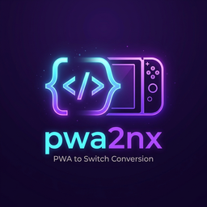

# pwa2nx 🚀

<p align="center">
  
</p>

[](https://github.com/FaserF/pwa2nx/actions/workflows/build-and-release.yml)
[](https://opensource.org/licenses/MIT)

**pwa2nx** is a highly automated, universal web-to-Switch translator that packages Progressive Web Apps (PWAs) and standard websites into ready-to-install Nintendo Switch homebrew applications (`.nro` / Appstore `.zip`).

Built on top of `libnx` and utilizing the Switch's internal NetFront NX web applet, it bridges the gap between web experiences and homebrew, offering profile-backed session persistence, a built-in OTA self-updater, and automated matrix builds via GitHub Actions.

---

## 🌟 Key Features

- **Native WebKit Applet Wrapper:** Runs directly inside the system web applet with full hardware acceleration.
- **PWA Manifest Auto-Parsing:** Dynamically extracts PWA icons, titles, and parameters during the build pipeline.
- **Strict Session Persistence:** Associates the browser cache, cookies, and `localStorage` with a Switch user profile (using `psel` and `webConfigSetUid`), preventing login resets.
- **Built-in Auto Updater:** Automatically checks the GitHub API for releases and updates the NRO in place.
- **CI/CD Integration:** Builds production-ready binaries on every manual workflow execution or tag release.
- **Homebrew Appstore Support:** Bundles correct metadata (`app.json`) and directories out of the box.

---

## 🛠️ Officially Supported Targets

Precompiled targets are built and verified:
- **Telegram**
- **Disney+**
- **Home Assistant**
- **Spotify**
- **SoundCloud**
- **YT Music**
- **Universal App:** Prompting for any URL on boot via software keyboard.

---

## 🚀 How to Build Yours

You don't need to install devkitPro locally. The entire build pipeline is offloaded to GitHub Actions.

1. **Fork this repository**.
2. Go to the **Actions** tab.
3. Select the **Build and Release PWA to Switch** workflow.
4. Click **Run workflow** and fill in the details:
   - **App Name:** The name of your application (e.g., `Home Assistant`).
   - **Website URL:** The URL of the website or PWA (e.g., `https://my-home-assistant.duckdns.org` or use `universal` to prompt on launch).
   - **Icon URL (Optional):** Fallback URL for the icon if the website isn't a PWA or you want a custom image.
5. Retrieve your compiled `.nro` and Homebrew Appstore package from the generated **GitHub Release**.

---

## 📂 Repository Structure

```
├── .github/
│   ├── ISSUE_TEMPLATE/
│   │   ├── bug_report.md           # Issue report template
│   │   ├── feature_request.md      # Feature request template
│   │   └── pwa_request.md          # Dedicated PWA support template
│   ├── labeler.yml                 # File path mappings to labels
│   ├── pull_request_template.md    # Pull Request description template
│   └── workflows/
│       ├── build-and-release.yml   # GHA compilation pipeline
│       ├── ci.yml                  # Code quality linter & unit test validation
│       ├── labeler.yml             # Automatic PR label applier
│       └── rollback.yml            # Rollback release tag workflow
├── docs/
│   └── architecture.md             # Contributor architecture overview
├── source/
│   ├── main.c                      # Main wrapper entry & applet config
│   ├── config.h                    # Build-time app variables
│   ├── updater.c / .h              # Network auto-updater logic
│   └── icon.png                    # Compiled Switch app icon (256x256)
├── scripts/
│   ├── extract_pwa.py              # PWA manifest parser & image processor
│   ├── generate_changelog.py       # Git changelog generator
│   ├── version_manager.py          # Semver file bump manager
│   └── preflight.py                # Pre-build validation script
├── tests/
│   └── test_automation.py          # Python automation unit tests
├── Makefile                        # devkitPro compilation script
├── app.json                        # Homebrew Appstore metadata
├── LICENSE                         # Project MIT license
└── README.md                       # Documentation
```

---

## 📖 Architecture & Contribution

For detailed design notes regarding Applet memory limitations, profile management, and wrapper structure, check out the [architecture guide](file:///docs/architecture.md).

---

## 💻 Local Development

If you prefer building locally, ensure you have the `devkitA64` toolchain and the required portlibs installed:

```bash
dkp-pacman -S devkitA64 switch-curl switch-mbedtls switch-zlib
make
```

---

## ⚠️ Disclaimer

This project is an unofficial wrapper wrapper and is in no way affiliated, associated, authorized, endorsed by, or in any way officially connected with the creators or operators of the supported PWA platforms (including but not limited to Disney+, Telegram, Home Assistant, Spotify, SoundCloud, YouTube Music, etc.). All product names, logos, and brands are property of their respective owners.

---

## 📝 License

This project is licensed under the MIT License. See [LICENSE](LICENSE) for details.
