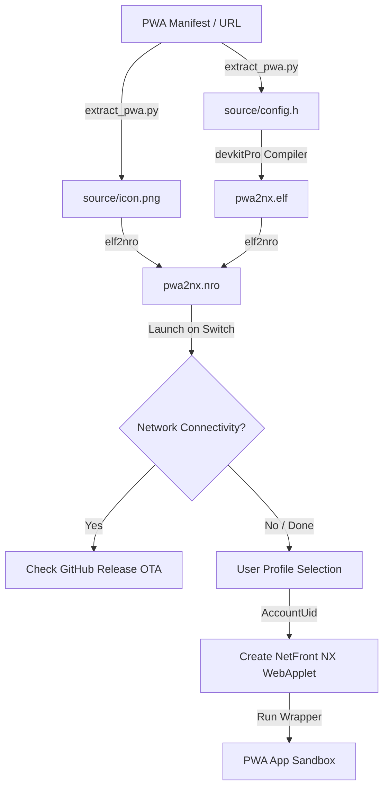

# Architecture and Contributor Guidelines

This document details the architecture, design patterns, and homebrew internals of **pwa2nx** for contributors wishing to extend or debug the wrapper.

---

## 🏛️ System Architecture Overview

---

## 💾 Applet Mode & Memory Allocation

The Nintendo Switch operating system runs homebrew applications under two main memory configurations:

1. **Applet Mode:** Homebrew launched via the Album applet has a heavily restricted memory environment (around 400MB total heap). This is insufficient for heavy WebKit engines, leading to crashes or network failures on media-heavy PWAs.
2. **Title Takeover (Full-Memory Mode):** Launched by holding `R` while opening any installed game/title. This allocates the entire application-specific RAM space to the homebrew (up to 3.2GB).

> [!WARNING]
> While `pwa2nx` works in Applet Mode for lightweight websites, complex PWAs (e.g., Disney+, Plex-based services, or Home Assistant panels with streaming video) **must** be run using Title Takeover or a HOME menu NSP forwarder to avoid out-of-memory crashes.

---

## 🍪 Session Persistence Mechanism

Session persistence (keeping cookies, login status, and `localStorage` saved across reboots) is managed via Nintendo's account service integration:

- **UID Mounting:** The wrapper calls `pselShowUserSelector` to retrieve the current user's `AccountUid`.
- **Sandbox Association:** This UID is registered to the web configuration object using `webConfigSetUid`. The system WebKit applet then binds all local database stores, service workers, cookies, and cache files directly into the save data partition associated with that specific profile.

---

## 🔄 OTA Self-Updater Logic

On startup, if internet connectivity is confirmed via `nifmGetCurrentIpAddress`, the wrapper queries the GitHub REST API (`/releases/latest`) using `libcurl`:
- SSL verification is explicitly adjusted (`CURLOPT_SSL_VERIFYPEER = 0L`) to run reliably on custom firmware without requiring pre-installed system certificates.
- The latest tag name is compared with the built-in `APP_VERSION`.
- If an update is detected, the wrapper fetches the `.nro` binary and overwrites `sdmc:/switch/pwa2nx/pwa2nx.nro` directly on the SD card.
